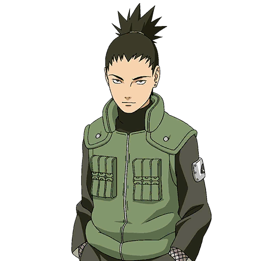

# A little bit of honesty goes a long way
There is something I have been thinking about a lot recently. Now I don't know if you ever watched anime but I watched a fair bit of it when I was younger. Every shonen whether it is Naruto, DBZ or Hunter X Hunter would always have 1 scene in it without fail. Where the MC would be beaten beyond recognition, defeated and down. Then would come the training montage. They would push themselves beyond the limits of humanity with literal blood sweat and tears. Then in the final battle by sheer willpower (and the power of friendship) they would achieve the impossible, vanquishing a foe that by all logic should have been 10 times more powerful than them. And as a kid there I would be. Teetering on the edge of my seat as they pushed through those final moments. 

Holding my breath as they launched their final attacks. Then revelling in the victory as if it were mine. I remember how that lit a fire inside me, I remember telling myself that I would do that in the future. Draining every last drop out of my life and giving it everything I had, doing whatever it took so that I could finally stand at the peak because that is what it meant to be successful. Or so I thought.

What I have come to realise since those days in my youth watching anime in my underwear is that, quite honestly, doing "whatever it takes" isn't worth it more often than not. It is only when I got older and I started to think back on things that I understood why my favourite characters were never the ones shouting from the rooftops how they were going to be the greatest. Instead they were the quiet background characters just doing their best and doing it well. I'll use the anime Naruto as an example. In that show my favourite character has always been this cool kid:

Shikamaru Nara. To put it bluntly this guy was lazy. Though I prefer to think of it as he was conserving energy instead of mindlessly running around expending it on tedious tasks. Don't get me wrong. When push came to shove this guy could deliver. Yet you would never find him having his own training montages. He was extremely intelligent, cared for his friends, and chill. 

He never wanted to be Hokage (The leader of the village and often the strongest ninja) but instead wanted nothing more than carefree days. Here is the important bit though. He was ok with that. I think this is why I admired him. Now I mentioned before he was intelligent, and he was arguably the most intelligent of their group. So some people may look at him and say he was wasting his talents. That he should have taken up greater mantles and attempted to change the world. Yet I think if he attempted to do so he wouldn't resonate with me the way he did. 

Basically I think it's ok that as a young, ambitious, intelligent person with their whole lives ahead of them to not want to change the world. To not want to make a billion dollar company, save the world, take man to mars and conquer the galaxy. Instead I honestly just want to be known as that chill and stable guy that you come to when you need help thinking through something. To spend plenty of my days doing nothing in particular, perhaps reading a book or learning a skill. Now I realise it'll take a lot of work to put my life in a state where I can have that freedom. 

Yet it won't require me to give away everything else. I think you would have noticed as well. Often our heroes, those whose names can be left behind in the history books, besides what they will eventually be known for often the rest of their lives are if they are lucky only unhealthy. I believe that is because to really become that 0.01% you have to be at least partially insane, partially obsessed. Now the world needs those people and for those people I have nothing but respect. It just doesn't have to be me.

What it comes down to is doing a little bit of soul searching. Not just one day brainstorming. Yet actually stopping for a bit, ruminating on what you have experienced, the people you have met, the people you have seen. Truly understanding who you are as a person and what you actually want out of life. For example me, I won't get obsessive over something to the point of losing myself. I can be lazy, yet I can think laterally and am a good big picture thinker. I specialise in seeing the steps to get from A to B yet I am often not the best person to walk them, unless I really need to.  I reckon I can give pretty  good advice and do pretty well following my advice. I don't get rocked too much by the ups and downs of life nor do I get that excited though about things I perhaps should be. 

I am in practice an introvert but I have a vanity to me and I like to be seen as intelligent. I love the idea of starting projects yet I'm not an execution person. Short term projects suit me best. Even if I start a business in the future I can hardly imagine running it for more than 5 years before moving onto a different project even if that means shutting down a thriving business. That is because I have a pretty short attention span and can bore easily. I adore working and surrounding myself with smart people and the feeling of growth I get by being around them. I have no grand desires to change the world. I want to prioritise lifestyle over wealth. I am a facilitator more than a creator. That is me. 

Honestly I am not fully sure what the purpose of this post is. I think it is about coming to terms with what we actually want. Being ok with wanting just enough and not the world. Knowing whether or not you would even be willing to put in the work required to make those grand dreams come true. Honestly weighing what you may have to give up and deciding whether it would be worth it for you. That is because we are all different and want different things out of life. After my period of soul searching the statement I came up with to describe what I actually want out of life is this:

I want to meet cool people and help them to do cool things.

That is it. I will probably write more at a later date about exactly what that means to me. But that is it for me. When new opportunities present themselves to me that is the filter I run it through to decide whether or not I believe it is worth it. That is what it boils down to for me. I wonder what it is for you?